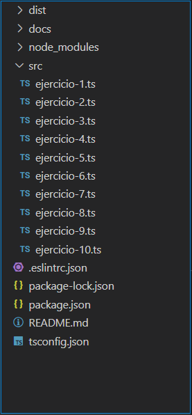

# Práctica 3 - DSI
## Tipos de datos estáticos y funciones

### Introducción

En este nuevo proyecto, con la estructura de directorios basada en las
anteriores prácticas, implementaremos 10 funciones diferentes para 
tener una primera toma de contacto con `Typescript`, concretamente con 
los apartados vistos en clase:
* [Creación de un proyecto inicial con Typescript](https://ull-esit-inf-dsi-2122.github.io/typescript-theory/typescript-project-setup.html)
* [Tipos de datos estáticos](https://ull-esit-inf-dsi-2122.github.io/typescript-theory/typescript-static-types.html)
* [Funciones](https://ull-esit-inf-dsi-2122.github.io/typescript-theory/typescript-functions.html)

### Estructura de nuestro proyecto

La estructura de directorios que hemos utilizado en esta práctica ha sido:



### Ejercicio 1 - Años bisiestos

La función devuelve un booleano indicando si el año pasado por parámetro. 
Con la definición de un año bisiesto indicada en el [pdf](https://ull-esit-inf-dsi-2122.github.io/prct03-types-functions/) de la práctica y 
el uso de un simple bloque if con esas condiciones el problema está resuelto.

```
function isLeapYear(Year: number): boolean {
  if ((Year%4 == 0) && ((Year%100 != 0) || (Year%400 == 0))) {
    return true;
  }
  return false;
}
```

### Ejercicio 2 - Notación decimal y factorial


### Ejercicio 3 - Conversor de estilo

Para el primer caso `fromSnakeToCamelCase`, empleamos el método `split` de `string` para separar
en un vector de palabras la cadena de entrada separados por `'_'`. Luego recorremos el vector y salvo
la primera palabra que va en minúscula, vamos poniendo en mayuscula la primera letra de la palabra y el
resto minuscula para ir añadiendola al final de una string resultado.

```
function fromSnakeToCamelCase(cad: string): string {
  // Get all cad's words in wordArray separated by '_'
  const wordArray: Array<string> = cad.split('_');
  let result: string = '';
  let firstChar: string = '';
  for (let i = 0; i < wordArray.length; i++) {
    if (i == 0) {
      firstChar= wordArray[i][0].toLowerCase();
    } else {
      firstChar = wordArray[i][0].toUpperCase();
    }
    const restWord: string = wordArray[i].substring(1).toLowerCase();
    result += firstChar + restWord; 
  }
  return result;
}
```
``` 
console.log('alv_rod_gOm: ', fromSnakeToCamelCase('alv_rod_gOm'))
alv_rod_gOm:  alvRodGom
```

Para el caso contrario `fromCamelToSnakeCase`, recorremos la cadena caracter a caracter comprobando si 
este está en mayúscula. En ese caso, reemplazamos el caracter por el mismo en minuscula precedido por 
una `'_'` y con la sentencia `i++` saltamos al siguiente debvido a que hemos incorporado un nuevo caracter.

```
function fromCamelToSnakeCase(cad: string): string {
  let result: string = cad;
  for (let i = 0; i < result.length; i++) {
    if (result[i] == result[i].toUpperCase()) {
      result = result.replace(result[i], ('_' + result[i].toLowerCase()));
      i++; // Avanzamos uno mas debido a añadir '_'
    }
  }
  return result;
}
```
```
console.log('alvRodGom: ', fromCamelToSnakeCase('alvRodGom'));
alvRodGom:  alv_rod_gom
```

### Ejercicio 4 - Conversor ISBN

Siguiendo las pautas y las fórmulas de la práctica:

> (x1 * 10 + x2 * 9 + x3 * 8 + x4 * 7 + x5 * 6 + x6 * 5 + x7 * 4 + x8 * 3 + x9 * 2 + x10 * 1) mod 11 == 0

La función elimina los guiones '-' de la cadena de entrada y comprueba que tenga una longitud de 10.
A continuación, recorre los primeros 9 digitos convirtiendolos a enteros para luego multiplicarlos según 
la formula anterior y guardar la suma de estos valores para en el siguiente paso calcular el valor del
ultimo simbolo. Calculado este, se suma con la cantidad anterior y se obtiene el modulo 11 de ella para
comprobar si cumple la condicion de ISBN.

```
function isValidISBN(code: string): boolean {
  const cad: string = code.replace(/-/g, '');
  console.log('replace:', cad);
  if (cad.length != 10) {
    console.log('Tamaño: ', cad.length);
    return false;
  }
  let checksum: number = 0;
  for (let i = 0; i < 9; i++) {
    checksum += (parseInt(cad[i])) * (10 - i);
  }

  if (cad[9] == 'X') {
    checksum += 10;
  } else if (typeof cad[9] == 'number') {
    checksum += cad[9];
  } else {
    return false;
  }

  return ((checksum % 11) == 0)? true : false;
}
```
```
console.log('3-598-21507-X : ', isValidISBN('3-598-21507-X'));
console.log('359821507X : ', isValidISBN('359821507X'));

3-598-21507-X :  true
359821507X :  true
```

### Ejercicio 5 - Orden descendente

La solución de este problema recae sobretodo en el uso de un vector y sus metodos. En el primer bucle
separamos el numero en cada uno de sus digitos utilizando la operacion de resto para obtener el ultimo digito y la división entera para avanzar hacia el siguiente, introduciendolos en orden en el vector.

Luego empleamos el metodo `sort` del vector para ordenarlos y posteriormente recorremos el array 
multiplicando cada numero con su cifra y sumandolo al resultado para generar el numero con sus digitos
ordenados.

```
function descendente(numero: number): number {
  const numberArray: number[] = [];
  let result: number= 0;
  while (numero > 0) {
    numberArray.push(numero%10);
    numero = Math.floor(numero/10);
  }
  numberArray.sort();
  
  for (let i = 0; i < numberArray.length; i++) {
    result += numberArray[i] * 10**i;
  }
  return result;
}
```
```
console.log('76125321359: ', descendente(76125321359));
76125321359:  97655332211
```


### Ejercicio 7 - Wonder Woman

Según la definicion del problema de Cerberus, en el que la generación de cabezas sigue la secuencia:

En el caso de haber atacado por 4 vez.
> 2 * 3 * 4 * n 

La función opera empleando el siguiente algoritmo:

La variable `newheads` guardará el número de nuevas cabezas generadas en cada iteración, por eso al
inicio, en el ataque 1 vale `n`. Con un bucle, según el número de ataques `atack` que se indiquen 
calcularemos siguiendo los ejemplos de la hoja de practicas:

```
10 cabezas aparecen después del ataque 1: 5 - 1 + 10 = 14
20 cabezas aparecen después del ataque 2: 14 - 1 + 2 * 10 = 33
60 cabezas aparecen después del ataque 3: 33 - 1 + 2 * 3 * 10 = 92
```

En cada iteración, el número de cabezas `heads` perderá `1` debido al ataque, y el número de nuevas
cabezas `newheads` estará multiplicado en secuencia según cuantos ataques hayamos realizado ya 
(`j` recorre desde 1 hasta el nº de ataque actual `i`). `newheads` es sumado a `heads` para obtener 
el total de cabezas hasta el momento. Y para la siguiente iteración reseteamos `newheads` a `n`.

```
function wonderWoman(heads: number, n: number, atack: number): number {
  let newheads: number = n;
  let j: number = 1;
  for (let i = 1; i <= atack; i++) {
    heads--;
    j=1;
    while (j <= i) {
      newheads *= j;
      j++;
    }
    heads += newheads;
    newheads = n;
  }
  return heads;
}
```
```
console.log('h: 2 n: 1  a: 1 = ', wonderWoman(2, 1, 1));
console.log('h: 5 n: 10 a: 3 = ', wonderWoman(5, 10, 3));

h: 2 n: 1  a: 1 =  2
h: 5 n: 10 a: 3 =  92
```

### Ejercicio 8 - Entrenador Pokemon

La función `dañoEfectivo` devolverá el daño real causado según la fórmula:

> daño = 50 * (ataque / defensa) * efectividad

La forma de representar las debilidades ha sido la lucha más dificil de este problema.
La estructura que se muestra en esta solución tiene la ventaja de ser muy escalable.

```
type pokemonType = 'agua' | 'hierba' | 'fuego' | 'electrico'

function dañoEfectivo(tAtack: pokemonType, tDefend: pokemonType,
    ataque: number, defensa: number): number {
  let efectividad: number = 0;
  const fuerteContraAgua: pokemonType[] = ['hierba', 'electrico'];
  const debilContraAgua: pokemonType[] = ['fuego'];

  const fuerteContraFuego: pokemonType[] = ['agua'];
  const debilContraFuego: pokemonType[] = ['hierba'];

  const fuerteContraElectrico: pokemonType[] = [];
  const debilContraElectrico: pokemonType[] = ['agua'];

  const fuerteContraHierba: pokemonType[] = ['fuego'];
  const debilContraHierba: pokemonType[] = ['agua'];
  
  if (tAtack == tDefend) {
    return 50 * (ataque / defensa) * 0.5;
  }

  switch (tAtack) {
    case 'agua': {
      if (fuerteContraAgua.includes(tDefend)) {
        efectividad = 0.5;
      } else if (debilContraAgua.includes(tDefend)) {
        efectividad = 2;
      } else {
        efectividad = 1;
      } 
    }
    case 'fuego': {
      if (fuerteContraFuego.includes(tDefend)) {
        efectividad = 0.5;
      } else if (debilContraFuego.includes(tDefend)) {
        efectividad = 2;
      } else {
        efectividad = 1;
      } 
    }
    case 'electrico': {
      if (fuerteContraElectrico.includes(tDefend)) {
        efectividad = 0.5;
      } else if (debilContraElectrico.includes(tDefend)) {
        efectividad = 2;
      } else {
        efectividad = 1;
      } 
    }
    case 'hierba': {
      if (fuerteContraHierba.includes(tDefend)) {
        efectividad = 0.5;
      } else if (debilContraHierba.includes(tDefend)) {
        efectividad = 2;
      } else {
        efectividad = 1;
      } 
    }
  }   
  return 50 * (ataque / defensa) * efectividad;
}
```

Podemos desgranar la función para explicarla de manera más amena:

1. Definición de tipo.

> type pokemonType = 'agua' | 'hierba' | 'fuego' | 'electrico'

Esta definición de tipo hará mucho más legible el código.

2. Representación de debilidades.

He optado por el uso de vectores que representarán el conjunto de los tipos débiles o fuertes a
un tipo en concreto. De esta manera, en el futuro si se añadieran más tipos y sus relaciones,
solo deberiamos añadirlos a cada vector y crear como veremos en el siguiente apartado un `case`
para cada uno igual que los demás.

```
  const fuerteContraAgua: pokemonType[] = ['hierba', 'electrico'];
  const debilContraAgua: pokemonType[] = ['fuego'];

  const fuerteContraFuego: pokemonType[] = ['agua'];
  const debilContraFuego: pokemonType[] = ['hierba'];

  const fuerteContraElectrico: pokemonType[] = [];
  const debilContraElectrico: pokemonType[] = ['agua'];

  const fuerteContraHierba: pokemonType[] = ['fuego'];
  const debilContraHierba: pokemonType[] = ['agua'];
```

3. Calculo de la efectividad.

El primero representa el caso en el que los tipos del atacantes y el defensor sean iguales, 
calcula con `no muy efectivo` y retorna para acabar con la función.

En el caso contrario, entra en un `switch` dónde según el tipo del atacante, verá dónde se 
encuentra el tipo del adversario, si en el vector de los débiles o de los fuertes contra él, 
o el resto, aplicando su correspondiente efectividad. 

Con la efectividad obtenida, hacemos el calculo y devolvemos el resultado.

```
  if (tAtack == tDefend) {
    return 50 * (ataque / defensa) * 0.5;
  }

  switch (tAtack) {
    case 'agua': {
      if (fuerteContraAgua.includes(tDefend)) {
        efectividad = 0.5;
      } else if (debilContraAgua.includes(tDefend)) {
        efectividad = 2;
      } else {
        efectividad = 1;
      } 
    }
    case 'fuego': {
      if (fuerteContraFuego.includes(tDefend)) {
        efectividad = 0.5;
      } else if (debilContraFuego.includes(tDefend)) {
        efectividad = 2;
      } else {
        efectividad = 1;
      } 
    }
    case 'electrico': {
      if (fuerteContraElectrico.includes(tDefend)) {
        efectividad = 0.5;
      } else if (debilContraElectrico.includes(tDefend)) {
        efectividad = 2;
      } else {
        efectividad = 1;
      } 
    }
    case 'hierba': {
      if (fuerteContraHierba.includes(tDefend)) {
        efectividad = 0.5;
      } else if (debilContraHierba.includes(tDefend)) {
        efectividad = 2;
      } else {
        efectividad = 1;
      } 
    }
  }
  
  return 50 * (ataque / defensa) * efectividad;
```
```
console.log('agua vs fuego | a: 20 d: 40 = ',
    dañoEfectivo('agua', 'fuego', 20, 40));
console.log('hierba vs electrico | a: 10 d: 30 = ',
    dañoEfectivo('hierba', 'electrico', 10, 30));
console.log('fuego vs fuego | a: 20 d: 60 = ',
    dañoEfectivo('fuego', 'fuego', 20, 60));

agua vs fuego       | a: 20 d: 40 =  12.5
hierba vs electrico | a: 10 d: 30 =  16.666666666666664
fuego vs fuego      | a: 20 d: 60 =  8.333333333333332
```

### Ejercicio 9 - Astérix no entiende a estos romanos

Para la resolución de este problema también hacemos uso de otra función para convertir los caracteres
en su valor numérico, que implementa un simple `switch` con todos los posibles valores:

```
function rToD(r: string): number {
  let d: number = 0;
  switch (r) {
    case 'I': d = 1;
      break;
    case 'V': d = 5;
      break;
    case 'X': d = 10;
      break;
    case 'L': d = 50;
      break;
    case 'C': d = 100;
      break;
    case 'D': d = 500;
      break;
    case 'M': d = 1000;
      break;
    default:
      break;
  }
  return d;
}
```

En la función principal recorremos la cadena de entrada convirtiendo los caracteres a numeros para 
sumarlos al resultado, pero debemos comprobar si el numero calculado es mayor que el anterior, lo que
significaria que es un numero que representa la diferencia. En ese caso, restamos el doble de ese valor
anterior para conpensar la operación.

```
function romaToDecimal(romano: string): number {
  let resultado: number = 0;
  let anterior: number = 0;
  for (let i = 0; i < romano.length; i++) {
    const valor: number = rToD(romano[i]);
    resultado += valor;
    if (anterior < valor) {
      resultado -= anterior * 2;
    }
    anterior = valor;
  }
  return resultado;
}

```
```
console.log('MCMXCV = ', romaToDecimal('MCMXCV'));
console.log('MMXIV = ', romaToDecimal('MMXIV'));

MCMXCV =  1995
MMXIV =  2014
```

### Ejercicio 10 - Distancia de Manhattan

Empleando la fórmula indicada por [Wikipedia](https://es.wikipedia.org/wiki/Geometr%C3%ADa_del_taxista)

> | x 1 − x 2 | 2 + | y 1 − y 2 | 2 {\displaystyle {\sqrt {{|x_{1}-x_{2}|}^{2}+{|y_{1}-y_{2}|}^{2}}}} {\displaystyle {\sqrt {{|x_{1}-x_{2}|}^{2}+{|y_{1}-y_{2}|}^{2}}}}

sdasfasfas


